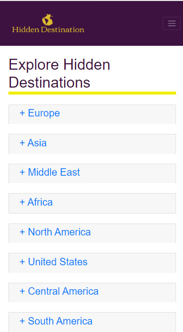
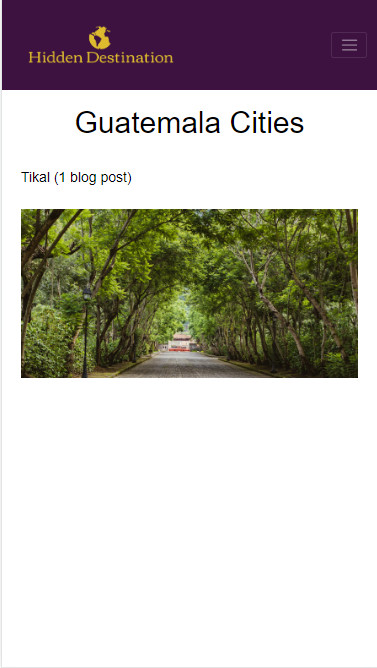
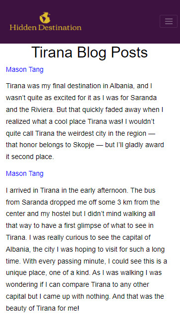

# HiddenDestination| Travel Blogging App

Find hidden destinations around the world

[See the live app here](https://hiddendestination.com/)

## Landing Page

## Register Page
Users can register for a new account by entering their email, username and password. Passwords are then encrypted, and the user is redirected to the destination page.

## Destination Page
Users can click on different continents and countries to find their next destination.

## City
Users can click on cities that have blog post.

 

## Blogs
Users can view blogs from that city.

## Technologies
* HTML
* CSS
* JavaScript
* jQuery
* Node.js
* Express
* MongoDB
* Mongoose
* Mocha
* Chai
* Chai-http

## Author
Mason Tang
